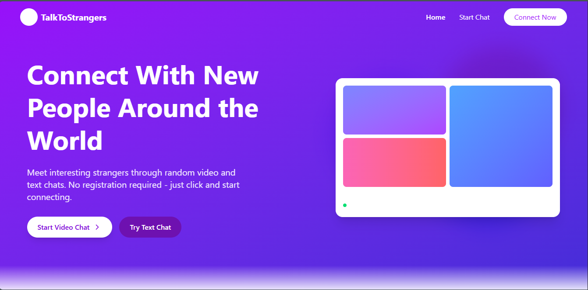

# TalkToStrangers 👥🌐

**TalkToStrangers** is a real-time, anonymous chat platform that connects random users globally through text and video chats. Designed to promote cultural exchange and open conversations, the platform ensures privacy and safety while offering customizable features.

## 🌟 Key Features
- 🔀 Random anonymous matchmaking  
- 💬 Text and video chat using WebRTC  
- 🏷️ Interest-based matching  
- 🌍 Language filters  
- 🛡️ Moderation, reporting, and blocking tools  
- ✉️ Private messaging with end-to-end encryption  
- 🎭 Anonymous profiles with customizations  
- ⭐ Feedback & ratings for user experience  
- 🧩 Optional private chat rooms and friend groups  

## 🛠️ Tech Stack
- **Frontend:** HTML, CSS, JavaScript  
- **Backend:** Node.js, Express.js  
- **Real-Time:** WebSockets, WebRTC  
- **Database:** MongoDB / Firebase (flexible)  
- **Authentication:** JWT / Anonymous auth  
- **Deployment:** Vercel / Heroku / Netlify  

## 🚀 Getting Started
1. Clone the repo  
2. Install dependencies: `npm install`  
3. Run the server: `npm start`  
4. Open in browser: `http://localhost:3000`

## 📸 UI Preview
The interface is designed to be minimal, user-friendly, and accessible across devices.

## 📄 License
MIT License

---
